# LabFlow - Enterprise Laboratory Management for Redmine

> Transform Redmine into a powerful Electronic Lab Notebook (ELN) and Laboratory Information Management System (LIMS)

---

## Overview

**LabFlow** is a comprehensive Redmine plugin that brings enterprise-grade laboratory management capabilities to your existing Redmine installation. Designed for research laboratories, pharmaceutical companies, biotech startups, and academic institutions, LabFlow provides a complete solution for managing samples, experiments, assays, and scientific data.

### Key Benefits

- **No separate system needed** - Works within your existing Redmine infrastructure
- **ISA-compliant** - Follows the Investigation-Study-Assay framework
- **21 CFR Part 11 ready** - Electronic signatures and audit trails
- **Scientific visualization** - Built-in molecular and sequence viewers
- **FAIR data principles** - Make your research findable and reusable

---

## Feature Highlights

### 1. Lab Flow Dashboard

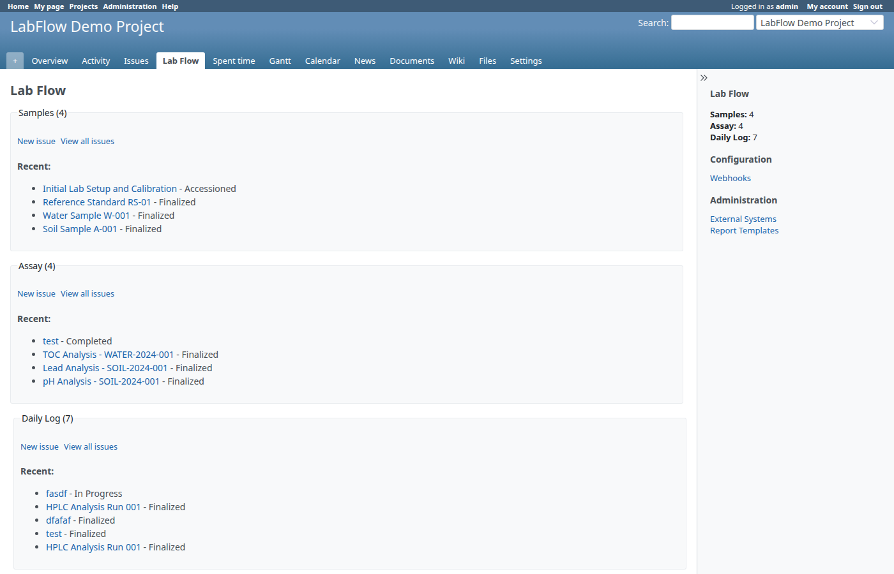

Central hub for all laboratory operations:

- **Quick access** to Samples, Assays, and Daily Logs
- **Recent activity** at a glance
- **Configuration links** to Webhooks and External Systems
- **Admin shortcuts** to Report Templates

---

### 2. Sample & Assay Tracking (LIMS)

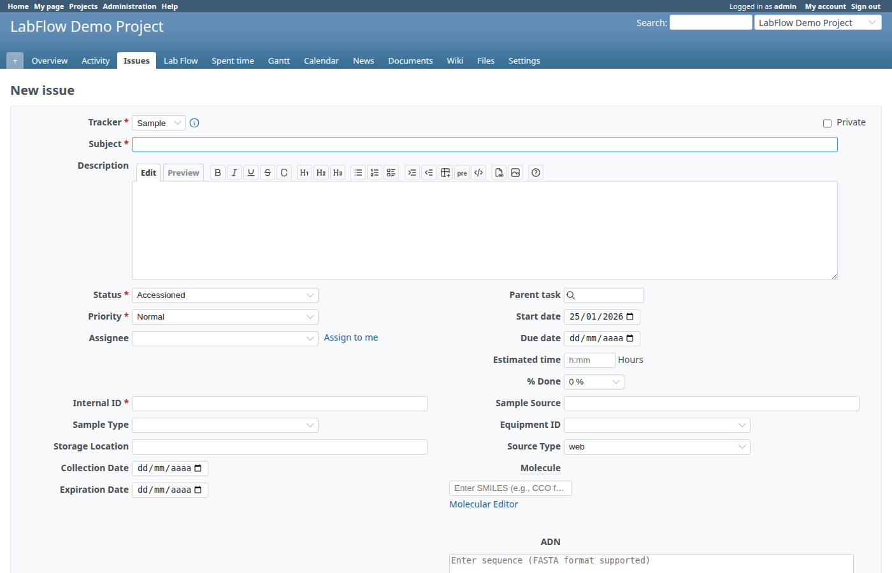

Full lifecycle management for laboratory samples:

| Feature | Description |
|---------|-------------|
| **Unique Identifiers** | Auto-generated Internal IDs |
| **Custom Fields** | Sample Type, Source, Storage Location |
| **Equipment Tracking** | Link samples to equipment |
| **Molecular Data** | SMILES notation for compounds |
| **Sequence Data** | DNA/RNA sequence attachment |

**Sample Detail View:**

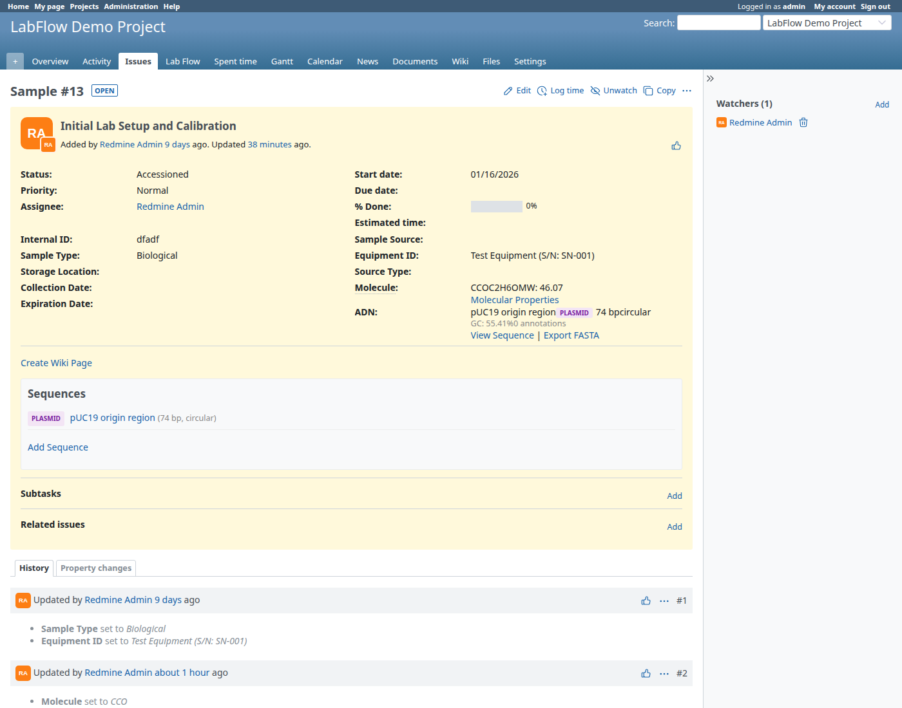

Each sample shows:
- Status workflow (Accessioned → In Analysis → Completed)
- Custom field values
- Attached sequences with quick actions
- Related issues and subtasks

---

### 3. Molecular Structure Viewer

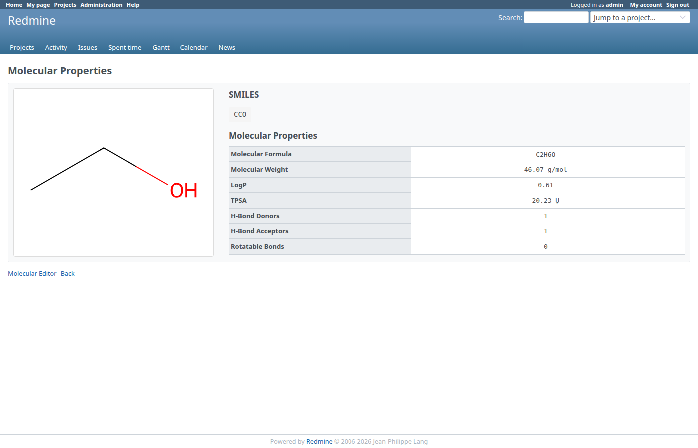

Built-in chemistry tools for compound management:

- **SMILES notation** support
- **Property calculation**:
  - Molecular Weight
  - Molecular Formula
  - LogP (lipophilicity)
  - TPSA (polar surface area)
  - H-Bond donors/acceptors
  - Rotatable bonds
  - Lipinski Rule of 5 compliance

---

### 4. DNA/RNA Sequence Viewer

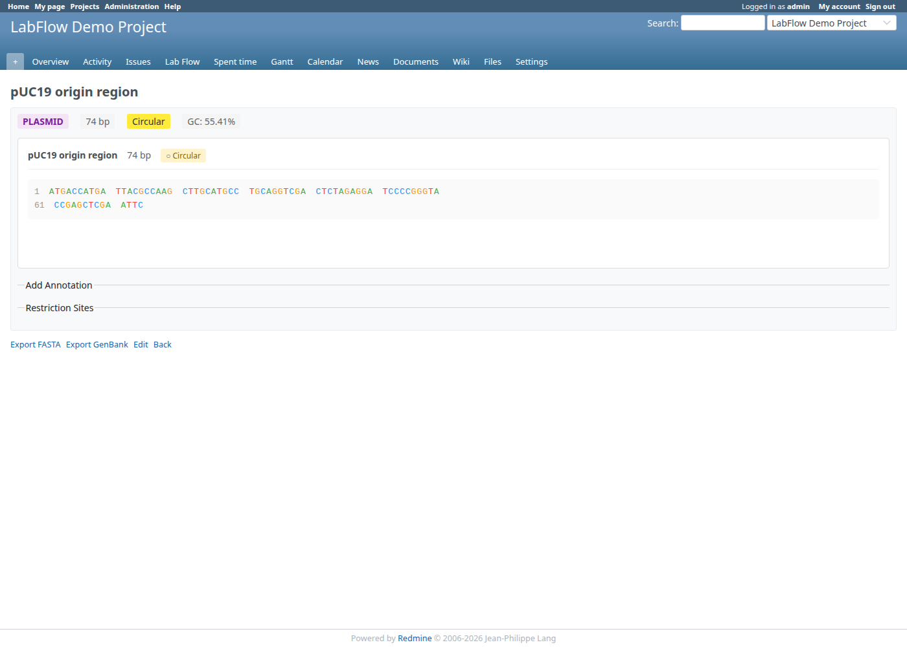

Comprehensive sequence management:

- **Color-coded display**: A(green), T(red), G(orange), C(blue)
- **Circular/Linear** sequence support
- **GC Content** calculation
- **Line numbering** for easy reference
- **Plasmid badges** for circular sequences

**Create New Sequence:**

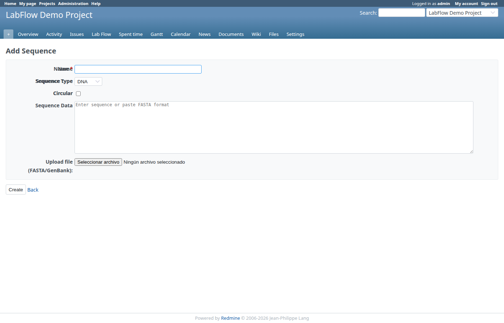

- Support for DNA, RNA, and Protein sequences
- FASTA format import
- File upload capability

---

### 5. External Systems Integration


Connect with your existing infrastructure:

**Supported Platforms:**
- **Galaxy** - Bioinformatics workflows
- **OpenBIS** - Research data management
- **Custom REST APIs** - Any system with HTTP API

**New External System Form:**

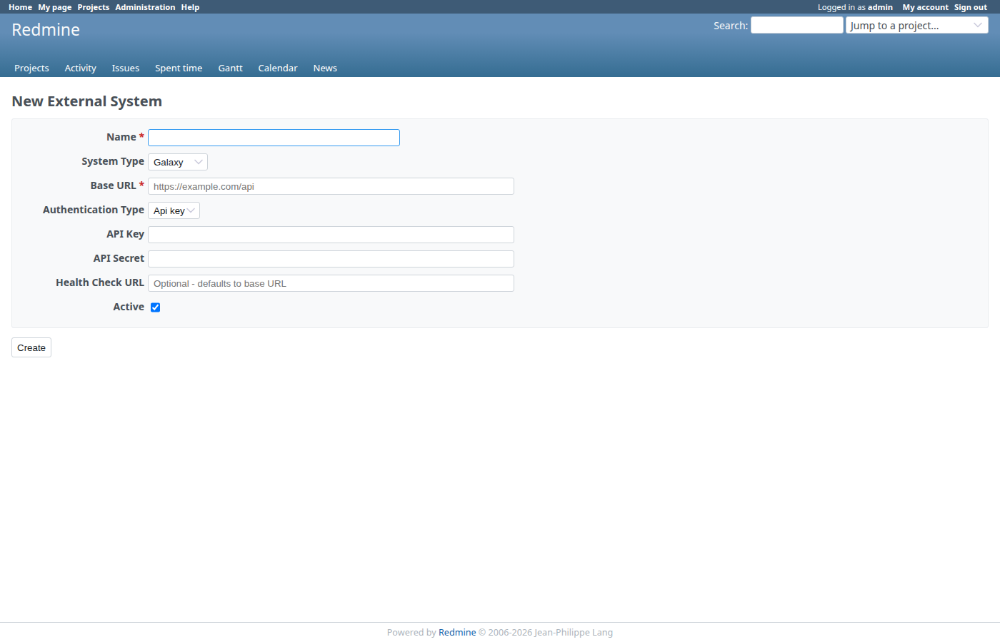

Configure:
- System type (Galaxy, OpenBIS, Custom)
- Base URL and authentication
- API credentials
- Health check endpoints

---

### 6. Report Templates

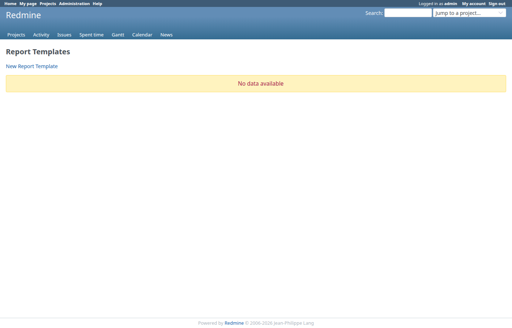

Generate professional reports with customizable templates:

**Create New Template:**

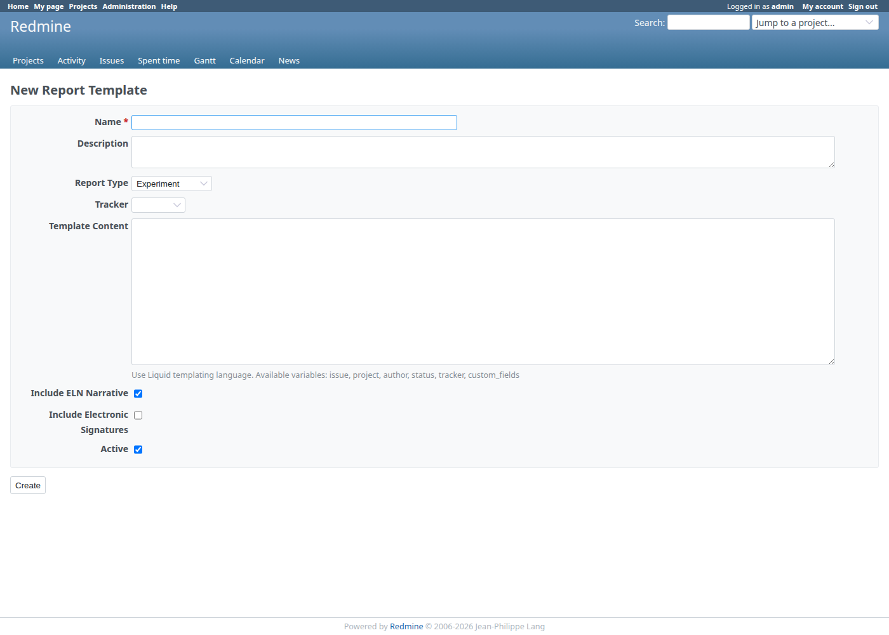

**Report Types:**
- Experiment Reports
- Sample Batch Reports
- Assay Summary Reports
- Compliance Reports
- Custom Reports

**Features:**
- Liquid templating language
- Include electronic signatures
- Embed ELN narratives
- Per-tracker templates

---

### 7. Webhooks

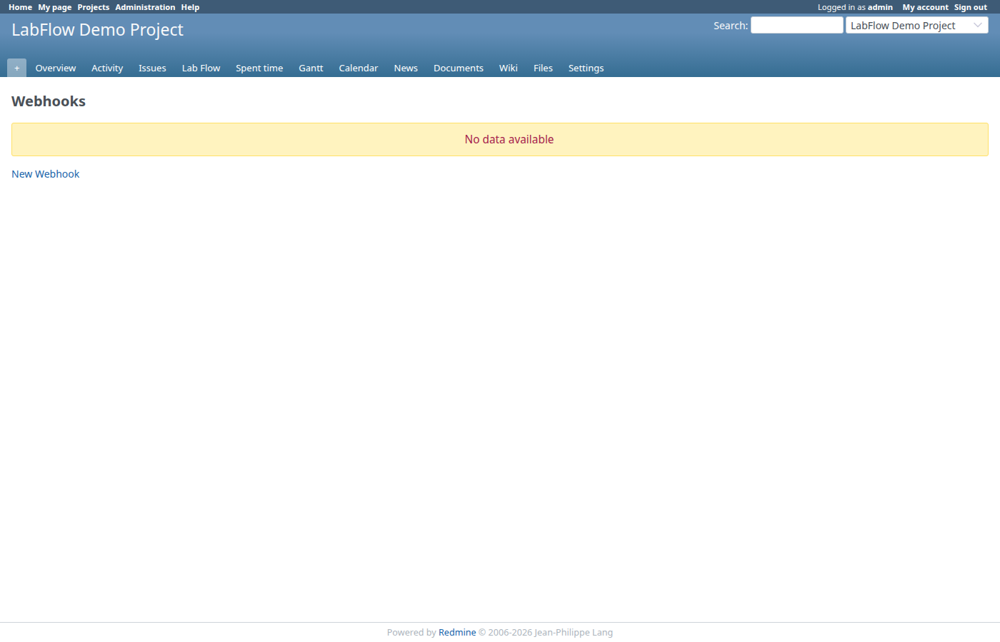

Real-time notifications for laboratory events:

**New Webhook Form:**

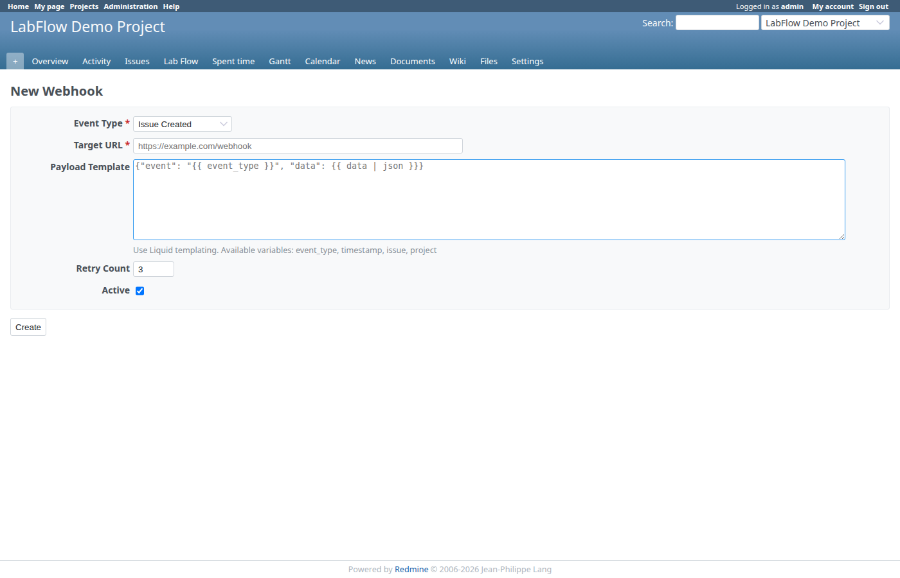

**Event Types:**
- Issue Created
- Issue Updated
- Status Changed
- Assay Completed
- Sample Accessioned
- Experiment Finalized

**Features:**
- Custom payload templates
- Retry configuration
- Per-project webhooks

---

## Technical Specifications

### Requirements

| Component | Version |
|-----------|---------|
| Redmine | 6.0.0 or higher |
| Ruby | 3.2+ |
| Rails | 8.x |
| Database | SQLite, PostgreSQL, MySQL |

### Installation

```bash
# Clone to plugins directory
cd /path/to/redmine/plugins
git clone https://github.com/your-org/redmine_lab_flow.git

# Run migrations
bundle exec rake redmine:plugins:migrate RAILS_ENV=production

# Restart Redmine
touch tmp/restart.txt
```

### Performance

- Handles **10,000+ issues** per project
- Optimized queries with **proper indexing**
- **Caching** for frequently accessed data
- **Async processing** for report generation

---

## Security Features

- **Role-based access control** - Granular permissions
- **Electronic signatures** - Password re-authentication
- **Audit logging** - Complete change history
- **API authentication** - Token-based access
- **Data encryption** - Credentials stored securely

---

## Pricing

| Edition | Features | Price |
|---------|----------|-------|
| **Community** | Core ELN + LIMS features | Free (Open Source) |
| **Professional** | + Electronic Signatures, Reporting | Contact us |
| **Enterprise** | + FAIR, Integrations, Priority Support | Contact us |

---

## Support & Services

### Documentation
- Comprehensive User Guide
- Administrator Manual
- API Reference

### Professional Services
- Installation & Configuration
- Custom Development
- Training Workshops
- Compliance Consulting

### Support Plans
- Community Forum (free)
- Email Support (Professional)
- Priority Support + SLA (Enterprise)

---

## Customer Success Stories

> "LabFlow transformed how we manage our research data. The electronic signatures feature was exactly what we needed for FDA compliance."
>
> — *Research Director, Biotech Company*

> "We replaced three separate systems with LabFlow. The integration with our existing Redmine made adoption seamless."
>
> — *Lab Manager, Academic Institution*

> "The molecular editor and sequence viewer save us hours every week. No more switching between applications."
>
> — *Principal Investigator, Pharmaceutical R&D*

---

## Getting Started

### Quick Start Guide

1. **Install the plugin** (5 minutes)
2. **Enable the module** in your project
3. **Configure trackers** for Samples, Assays, Daily Logs
4. **Start creating** samples, logs, and assays

### Contact Us

- **Email**: sales@labflow.example.com
- **Documentation**: See USER_GUIDE.md
- **GitHub**: https://github.com/your-org/redmine_lab_flow

---

## License

LabFlow Community Edition is released under the GNU General Public License v2 (GPLv2), the same license as Redmine.

Professional and Enterprise features are available under a commercial license.

---

*LabFlow - Bringing Scientific Data Management to Redmine*

**Version 0.5.0** | Last Updated: January 2026
